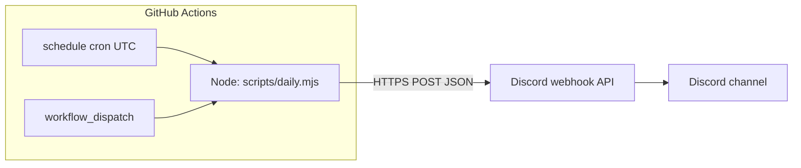

# Discord daily standup (GitHub Actions)

Posts a **daily message** to a Discord channel using an **incoming webhook**. No bot process, no server, and no Discord bot token—only a small Node script and a scheduled **GitHub Actions** workflow.

**Default schedule:** every day at **11:00 AM** [Georgia / Tbilisi](https://www.timeanddate.com/time/zones/get) (`Asia/Tbilisi`, UTC+4, no DST). The workflow runs at **07:00 UTC** so typical GitHub Actions delay still lands closer to late morning than noon.

---

## What you need

| Requirement | Notes |
|-------------|--------|
| **GitHub repository** | Workflow must live on the **default branch** (`main` / `master`) for `schedule` to run. |
| **Discord webhook** | Channel → Integrations → Webhooks → New Webhook (or Server Settings → Integrations). Copy the **Webhook URL**. |
| **Node.js 18+** | For local runs only; Actions uses Node 20 from the workflow. |

---

## Quick start (GitHub)

1. **Push this repo** to GitHub (ensure `.github/workflows/daily-discord.yml`, `scripts/daily.mjs`, and `package.json` are included).
2. In the repo: **Settings → Secrets and variables → Actions**.
3. **New repository secret**
   - **Name:** `DISCORD_WEBHOOK_URL`
   - **Value:** your full Discord webhook URL (starts with `https://discord.com/api/webhooks/...`).
4. Optional: **New repository secret**
   - **Name:** `DISCORD_MESSAGE`
   - **Value:** custom text for every run. If omitted, the script uses the [default line](#message) in `scripts/daily.mjs`.
5. **Actions → “Daily Discord webhook” → Run workflow** to verify a message appears in Discord.
6. Wait for the next **scheduled** run, or keep using manual runs for testing.

**Do not** commit the webhook URL. Treat it like a password; only store it in **Secrets**.

---

## How it works



1. **Schedule** (`cron`) or **manual** (`workflow_dispatch`) starts the workflow.
2. The job checks out the repo, sets up Node, and runs `npm run daily`.
3. `scripts/daily.mjs` sends a `POST` with `Content-Type: application/json` and body `{ "content": "<message>" }` to the webhook URL.

---

## Message

- **Default** (when `DISCORD_MESSAGE` secret is not set or empty):  
  `Good morning, folks! What did you work on yesterday, and what are you going to work on today?`
- **Override without code changes:** set the `DISCORD_MESSAGE` repository secret (multiline is fine; leading/trailing whitespace is trimmed).
- **Change the default permanently:** edit `defaultMessage` in `scripts/daily.mjs` and push.

---

## Schedule and time zones

GitHub’s `schedule` trigger uses **UTC only**. This repo maps **11:00 Tbilisi** to **07:00 UTC**:

```yaml
cron: "0 7 * * *"
```

| Tbilisi (GET, UTC+4) | UTC (cron) | `cron` minute field | `cron` hour field |
|----------------------|------------|---------------------|-------------------|
| 11:00                | 07:00      | `0`                 | `7`               |

To change the posting time:

1. Pick the desired **Tbilisi** time.
2. Subtract **4 hours** for **UTC** (Tbilisi is always UTC+4).
3. Set `cron` to `minute hour * * *` (see [GitHub docs on `schedule` events](https://docs.github.com/en/actions/using-workflows/events-that-trigger-workflows#schedule)).

**Note:** Scheduled runs are **not guaranteed** to start at the exact minute; short delays are normal.

---

## Local testing

From the repository root:

```bash
export DISCORD_WEBHOOK_URL="https://discord.com/api/webhooks/..."
# optional:
export DISCORD_MESSAGE="Local test message"
npm run daily
```

On Windows (PowerShell) use `$env:DISCORD_WEBHOOK_URL="..."` instead of `export`.

---

## Repository layout

| Path | Purpose |
|------|---------|
| `.github/workflows/daily-discord.yml` | Defines schedule, manual trigger, secrets → env, and `npm run daily`. |
| `scripts/daily.mjs` | Reads env, `POST`s JSON to Discord. |
| `package.json` | `npm run daily` → `node scripts/daily.mjs`. |
| `.gitignore` | Ignores `node_modules/` and `.env*` (optional for local secrets). |

There are **no npm dependencies**; the script uses the built-in `fetch` (Node 18+).

---

## Troubleshooting

| Symptom | What to check |
|---------|----------------|
| **No scheduled runs** | Workflow file is on the **default branch**. Forks and some org policies can disable schedules. |
| **Workflow fails immediately** | `DISCORD_WEBHOOK_URL` is set under **Actions** secrets (exact name). |
| **403 / 404 from Discord** | Webhook was deleted or URL is wrong; create a new webhook and update the secret. |
| **Message not what you expect** | `DISCORD_MESSAGE` secret overrides the default; remove or change it. |
| **Run appears minutes late** | Expected for `schedule`; use an earlier UTC cron if you need messages before a wall-clock deadline. |

Logs: **Actions → select run → job → “Post to Discord”** step.

---

## Security

- **Rotate** the webhook if the URL was ever committed, pasted in a ticket, or shared publicly: delete the webhook in Discord, create a new one, update `DISCORD_WEBHOOK_URL`.
- Anyone with the URL can post to that channel until you rotate it.
- Repository **secrets** are masked in logs; still avoid printing the URL from custom scripts.
